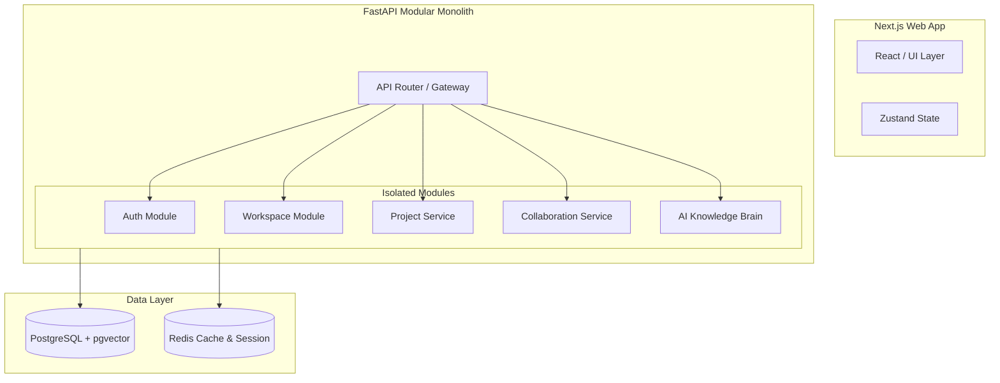

# SynapseIQ System Architecture

This document details the architectural decisions, folder layouts, and system design patterns used in building SynapseIQ.

---

## 1. Architectural Strategy: The Modular Monolith

For early-stage startups, building microservices from Day 1 is often a mistake (anti-pattern) due to:
* High network overhead and latency.
* Complex distributed transactions (Saga Pattern, 2PC).
* Deployment overhead (managing multiple pipelines).
* Cognitive load for a single developer.

Instead, we use a **Modular Monolith**. 

### What is a Modular Monolith?
A Modular Monolith is a single, unified codebase (monolith) where code is strictly divided into distinct, self-contained modules. Each module represents a business domain (e.g., Auth, Projects, Chat, AI). 

* **Strict Boundary Rules**: Modules must not directly call each other's database models or internal functions. Instead, they communicate via clear, public API/service interfaces or internal event dispatchers.
* **Database Isolation**: Tables belong to specific modules. A module should never run SQL joins across tables owned by another module.

When the platform scales and needs to be broken into microservices, we can easily extract these isolated module folders into standalone deployment units (services) with minimal code changes.



---

## 2. Directory Layout & Module Structure

The project root is structured as a Monorepo:

```
SynapseIQ/
├── backend/                  # FastAPI Backend Monolith
│   ├── app/                  # Main Application Code
│   │   ├── core/             # Global configurations, security, DB connections
│   │   ├── modules/          # Domain Modules
│   │   │   ├── auth/         # Module 1: Authentication & Roles
│   │   │   ├── workspace/    # Module 2: Workspaces & Members
│   │   │   ├── projects/     # Module 3: Projects & Sprints
│   │   │   └── ...           # Other modules (Chat, Docs, AI, etc.)
│   │   └── main.py           # FastAPI initialization
│   ├── requirements.txt      # Python dependencies
│   └── alembic.ini           # Database migrations config
├── frontend/                 # Next.js Frontend App
├── docs/                     # Detailed architectural learning guides
└── docker-compose.yml        # Development environment services
```

---

## 3. Communication Patterns

* **Synchronous (HTTP/REST)**: The frontend interacts with the modules via REST endpoints defined by FastAPI routers.
* **Asynchronous (Event/Queue)**: 
  - Initially, we will use FastAPI's built-in `BackgroundTasks` for non-blocking actions like sending emails or kicking off RAG processing.
  - Later, we will integrate **Apache Kafka** as a distributed event streaming broker to handle decoupled events like `Document Uploaded` or `Message Sent` in real-time.
