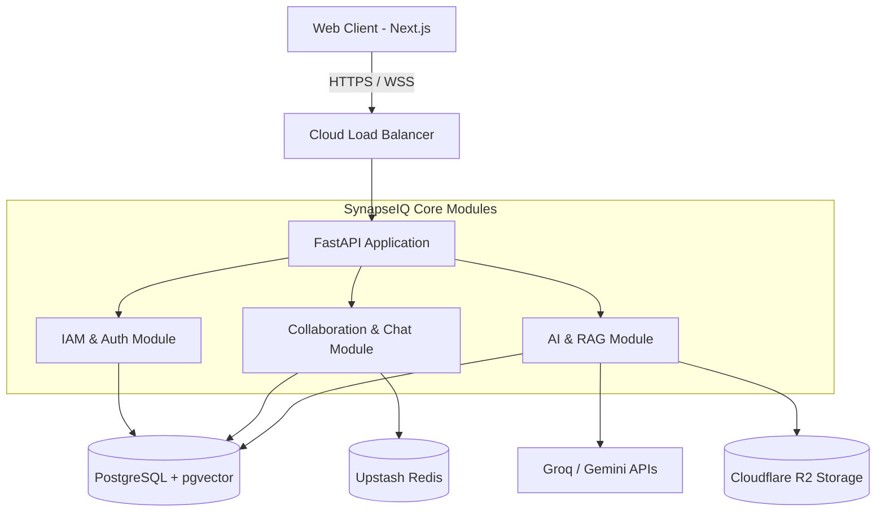

<div align="center">
  <h1>🧠 SynapseIQ</h1>
  <p><strong>The Next-Generation AI-Powered Organizational Intelligence Platform</strong></p>

  <p>
    <a href="#features"></a>
    <a href="#tech-stack"></a>
    <a href="#architecture"></a>
    <a href="#deployment"></a>
  </p>
</div>

---

## 🌟 Overview

**SynapseIQ** is an enterprise-grade AI-powered Organizational Intelligence Platform. It transcends traditional collaboration tools by acting as the unified "Brain" of your organization. It combines team collaboration, secure workspaces, real-time communication, and AI-driven knowledge management into a single, cohesive ecosystem.

By leveraging cutting-edge LLMs (Groq, Gemini) and semantic vector search (`pgvector`), SynapseIQ not only stores your company's data but actively understands it—turning passive documents and conversations into actionable organizational memory.

## ✨ Key Features

- 🔐 **Secure Workspaces (RBAC):** Military-grade Role-Based Access Control ensuring strict data isolation between teams and organizations.
- 💬 **Real-time Collaboration:** Instant messaging and real-time state synchronization powered by WebSockets and Upstash Redis.
- 🤖 **AI-Powered Insights:** Deep integration with AI models (Groq, Gemini) to summarize meetings, generate action items, and query company knowledge.
- 🧠 **Semantic Vector Search:** Ask natural language questions about your company's documents, and our RAG (Retrieval-Augmented Generation) pipeline will find the exact answers.
- 📂 **Cloud Storage Integration:** Scalable and cost-effective file handling using Cloudflare R2 / AWS S3.
- ⚡ **High-Performance Architecture:** Built with a Modular Monolith approach to ensure rapid delivery today, while being 100% ready for Microservices tomorrow.

---

## 🛠️ Tech Stack

### Frontend Architecture
- **Framework:** [Next.js 14](https://nextjs.org/) (App Router)
- **Language:** TypeScript
- **Styling:** Tailwind CSS, Framer Motion (for fluid, FAANG-level micro-interactions)
- **State Management:** Zustand
- **Deployment:** Vercel Global Edge Network

### Backend Architecture
- **Framework:** [FastAPI](https://fastapi.tiangolo.com/) (High-performance async Python framework)
- **Language:** Python 3.10+
- **ORM:** SQLAlchemy 2.0 & Alembic (Database Migrations)
- **Database:** PostgreSQL on [Supabase](https://supabase.com/) (with Transaction Pooling & `pgvector` for AI search)
- **Caching & Pub/Sub:** [Upstash Redis](https://upstash.com/) Serverless Infrastructure
- **Storage:** Cloudflare R2 / AWS S3 via Boto3
- **Deployment:** [Render](https://render.com/) (Dockerized, Multi-worker Uvicorn architecture)

---

## 🏗️ System Architecture

SynapseIQ employs a strict **Modular Monolith** pattern. This ensures the simplicity of a single deployable unit while maintaining strict domain boundaries.



---

## 🚀 Production Deployment Flow

Our production infrastructure is designed for extreme scale, security, and zero-downtime capabilities.

1. **Database:** Supabase PostgreSQL with `pool_size=20` and `max_overflow=10` via Transaction Pooler for handling massive concurrent connections.
2. **Caching:** Serverless Upstash Redis via `rediss://` encrypted connections.
3. **Backend Deployment:** Render using a custom `Dockerfile` configured with `uvicorn --workers 4` to bypass the Python GIL and utilize multi-core CPU instances effectively.
4. **Frontend Deployment:** Vercel globally distributed edge network with strict CORS policies restricted only to verified origins.
5. **Security Implementations:**
   - Global 500-error catching to prevent internal stack leakages.
   - Strict CORS configuration mapping backend `<->` frontend.
   - Advanced JSON Web Tokens (JWT) mapped to highly secure, rotating secrets.

---

## 💻 Local Development Setup

To run SynapseIQ locally, please follow the steps below:

### 1. Clone the Repository
```bash
git clone https://github.com/Shinu-Cherian/SynapseIQ.git
cd SynapseIQ
```

### 2. Run Database & Cache (Docker)
Ensure Docker is running on your machine.
```bash
docker-compose up -d
```

### 3. Start the Backend
```bash
cd backend
python -m venv venv
source venv/bin/activate  # On Windows: venv\Scripts\activate
pip install -r requirements.txt
uvicorn app.main:app --reload --port 8000
```

### 4. Start the Frontend
```bash
cd frontend
npm install
npm run dev
```

---

## 📚 Documentation & Interview Prep

We treat this repository not just as a product, but as an engineering masterclass. All detailed documentation regarding our system design choices, scaling strategies, and architectural decisions can be found in the `docs/` folder.
- [Docker & Containerization Strategies](docs/Docker.md)
- [System Architecture Breakdown](ARCHITECTURE.md)

---

<div align="center">
  <p>Built with ❤️ by the SynapseIQ Engineering Team.</p>
</div>
