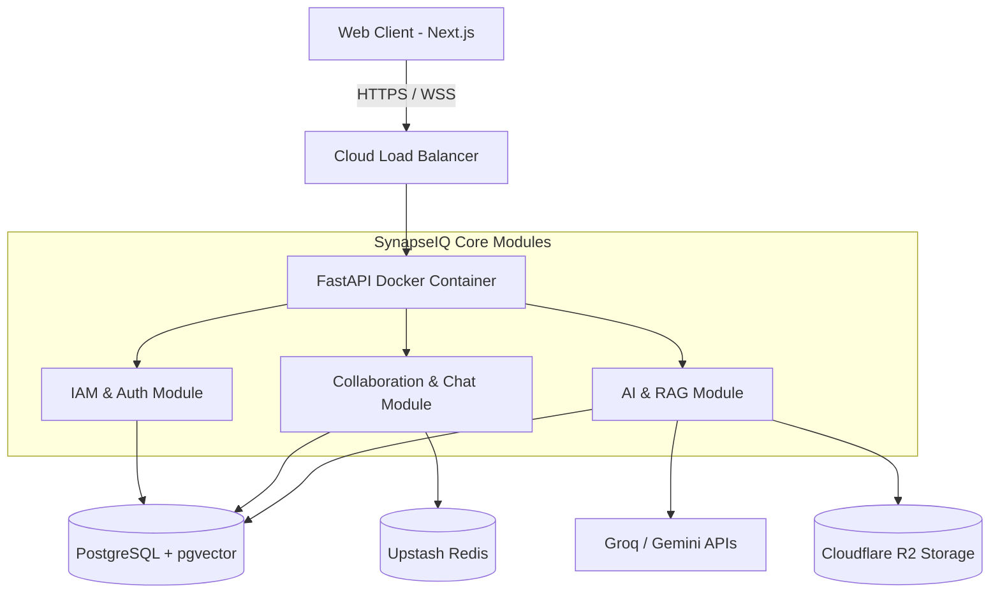

  <h1>🧠 SynapseIQ</h1>
  
<strong>The Next-Generation AI-Powered Organizational Intelligence Platform</strong>

  

    
    
    
    
  

---

## 🌟 Overview

**SynapseIQ** is an enterprise-grade AI-powered Organizational Intelligence Platform. It transcends traditional collaboration tools by acting as the unified "Brain" of your organization. It combines team collaboration, secure workspaces, real-time communication, and AI-driven knowledge management into a single, cohesive ecosystem.

By leveraging cutting-edge LLMs (Groq, Gemini) and semantic vector search (`pgvector`), SynapseIQ not only stores your company's data but actively understands it—turning passive documents and conversations into actionable organizational memory.

## ✨ Key Features

- 🔐 **Secure Workspaces (RBAC):** Military-grade Role-Based Access Control ensuring strict data isolation.
- 💬 **Real-time Collaboration:** Instant messaging and real-time state synchronization.
- 🤖 **AI-Powered Insights:** Deep integration with AI models to summarize meetings and query knowledge.
- 🧠 **Semantic Vector Search:** Ask natural language questions via our RAG pipeline.
- 📂 **Cloud Storage Integration:** Scalable file handling.
- ⚡ **High-Performance Architecture:** Built with a Modular Monolith approach.

---

## 🛠️ Comprehensive Tech Stack

We utilize a robust, modern, and scalable stack suitable for FAANG-level engineering standards.

| Category | Technology / Tool | Purpose |
| :--- | :--- | :--- |
| **Frontend Framework** | **Next.js 14** (App Router) | Core frontend architecture, SSR, SEO, and fast routing. |
| **Styling & UI** | **Tailwind CSS & Framer Motion** | Utility-first styling and fluid, premium micro-animations. |
| **Backend Framework** | **FastAPI** (Python 3.10+) | High-performance async API development. |
| **Database** | **PostgreSQL (Supabase)** | Primary relational database with Transaction Pooling. |
| **Vector DB / Search** | **pgvector** | Semantic embedding storage and similarity search for AI. |
| **Caching & Pub/Sub** | **Upstash Redis** | Serverless Redis for real-time WebSocket communication and caching. |
| **Cloud Storage** | **Cloudflare R2** | Amazon S3-compatible, zero-egress-fee storage for user files/avatars. |
| **Containerization** | **Docker** | Creating isolated, reproducible builds for the backend. |
| **Orchestration** | **Kubernetes (K8s)** | System designed and tested for K8s deployment (Pods, ConfigMaps) for massive scale. |
| **AI Integrations** | **Groq API & Gemini** | Ultra-fast LLM inference for RAG and chat summarization. |
| **Deployment** | **Vercel & Render** | Global Edge Network (Frontend) and scalable continuous container deployment (Backend). |

---

## 🗄️ Database Schema & Entities

The relational database is structured to isolate organizational data strictly. Below are the primary entities managed via SQLAlchemy 2.0:

- **Users (`users`):** Handles authentication, personal details, and avatar links.
- **Workspaces (`workspaces`):** Virtual offices grouping related projects, channels, and team members.
- **Workspace Members (`workspace_members`):** Join table mapping users to workspaces with specific roles (Admin, Member, Guest) for RBAC.
- **Projects (`projects`):** Sub-divisions within a workspace to track specific goals.
- **Channels (`channels`):** Communication threads within projects or workspaces.
- **Messages (`messages`):** Real-time chat messages, including file attachments and system alerts.
- **Documents (`documents`):** Files uploaded to Cloudflare R2, with metadata stored here.
- **Vector Embeddings (`document_embeddings`):** Processed AI chunks of documents, stored as vectors for semantic search.

---

## 🏗️ System Architecture

SynapseIQ employs a strict **Modular Monolith** pattern. This ensures the simplicity of a single deployable unit while maintaining strict domain boundaries, perfectly positioned for a shift to Kubernetes Microservices in the future.

---

## 🚀 Production Deployment Flow

Our production infrastructure is designed for extreme scale, security, and zero-downtime capabilities.

1. **Database:** Supabase PostgreSQL with `pool_size=20` and `max_overflow=10` via Transaction Pooler for handling massive concurrent connections.
2. **Caching:** Serverless Upstash Redis via `rediss://` encrypted connections.
3. **Backend Deployment:** Render using a custom `Dockerfile` configured with `uvicorn --workers 4` to bypass the Python GIL. (Architected for Kubernetes deployment when horizontally scaling).
4. **Frontend Deployment:** Vercel globally distributed edge network with strict CORS policies.
5. **Security Implementations:**
   - Global 500-error catching to prevent internal stack leakages.
   - Strict CORS configuration mapping backend `<->` frontend.
   - Advanced JSON Web Tokens (JWT) mapped to highly secure, rotating secrets.

---

  
Built with ❤️ by the SynapseIQ Engineering Team.

