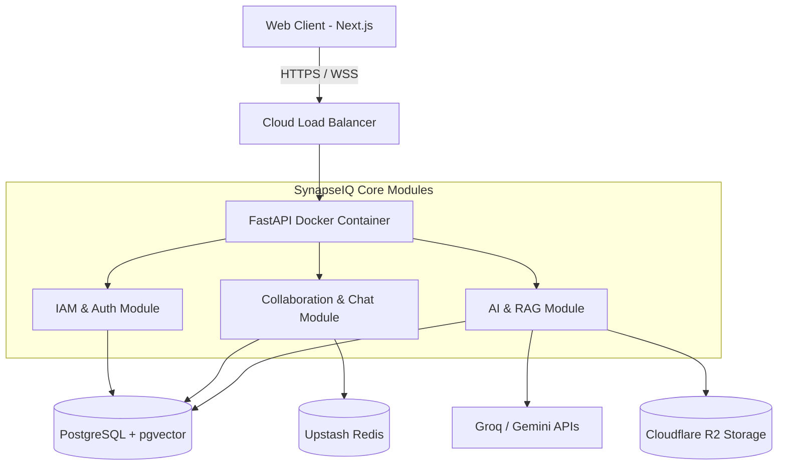

# 🧠 SynapseIQ — Organizational Intelligence Platform

> A premium enterprise-grade, full-stack workspace that combines team collaboration, project management, and AI-driven knowledge management into a unified platform.

[](https://fastapi.tiangolo.com/)
[](https://nextjs.org/)
[](https://www.postgresql.org/)
[](https://tailwindcss.com/)
[](https://www.python.org/)
[](https://www.docker.com/)

---

## 📌 Table of Contents

- [Overview](#-overview)
- [New Features (Latest Updates)](#-new-features-latest-updates)
- [Features](#-features)
- [Tech Stack](#-tech-stack)
- [Database Models](#-database-models)
- [System Architecture](#-system-architecture)
- [Deployment Flow](#-deployment-flow)
- [Local Development Setup](#-local-development-setup)

---

## 🌟 Overview

**SynapseIQ** is a production-grade, full-stack web application designed to act as the unified "Brain" of your organization. It transcends traditional collaboration tools by combining secure workspaces, real-time communication, and AI-driven knowledge management into a single, cohesive ecosystem.

Every project note, team discussion, document, and decision lives in a private, authenticated workspace — strictly isolated and visible only to authorized team members.

The platform leverages cutting-edge LLMs and semantic vector search (`pgvector`), turning passive documents and conversations into actionable organizational memory, wrapped in a stunning, modern UI with fluid animations.

---

## 🚀 New Features (Latest Updates)

Over the recent development iterations, SynapseIQ has evolved significantly to provide a FAANG-level user experience:

- **AI-Powered Semantic Search**: Deep integration with AI models (Groq, Gemini) to summarize meetings, generate action items, and query company knowledge using natural language.
- **Real-Time Collaboration**: Instant messaging and live state synchronization powered by WebSockets and serverless Upstash Redis.
- **Enterprise-Grade Security**: Strict CORS policies, global error handling to prevent stack leakages, and advanced JWT mechanisms mapped to rotating secrets.
- **Modular Monolith Architecture**: Built with a strict modular monolith pattern in Python, ensuring rapid delivery today while being 100% ready for Kubernetes Microservices tomorrow.
- **Zero-Egress Cloud Storage**: Scalable and cost-effective file handling using Cloudflare R2 / AWS S3 compatibility.

---

## ✨ Features

### 🔐 Secure Workspaces (RBAC)
- Military-grade Role-Based Access Control ensuring strict data isolation.
- Team Heads can create workspaces, generate invite links, and manage member roles (Admin, Member, Guest).
- Users log in via email and password, receiving a secure JWT (holographic digital seal) to access authorized data.

### 💬 Real-time Collaboration (Chat & Projects)
- Communication threads within projects or workspaces.
- Real-time chat messages, including file attachments and system alerts.
- Track specific goals and assign work efficiently.

### 🧠 AI-Powered Insights & RAG Pipeline
- Ask natural language questions about your company's documents.
- The RAG (Retrieval-Augmented Generation) pipeline finds exact answers by analyzing processed AI chunks stored as vector embeddings.
- Summarize meetings and generate automatic action items.

### 📂 Cloud Storage Vault
- Centralized file upload system securely linked to Cloudflare R2.
- Attach files to messages, projects, or store them in the workspace vault.

---

## 🛠️ Tech Stack

### Frontend
| Technology | Version | Purpose |
|---|---|---|
| Next.js | 14 | App Router, SSR, core frontend architecture |
| React | 18 | UI Components |
| Tailwind CSS | 3.4 | Utility-first responsive styling |
| Framer Motion | 11 | Fluid, premium micro-animations |
| Zustand | 4.5 | Global state management |
| Axios | 1.6 | API requests and interceptors |

### Backend
| Technology | Version | Purpose |
|---|---|---|
| Python | 3.11+ | Core backend language |
| FastAPI | 0.111 | High-performance async API framework |
| SQLAlchemy | 2.0 | Advanced ORM with Transaction Pooling |
| Alembic | 1.13 | Database migrations |
| Pydantic | 2.7 | Data validation and serialization |
| Uvicorn | 0.30 | ASGI production server (multi-worker) |
| python-jose | 3.3 | JWT authentication |

### Infrastructure & Databases
| Technology | Purpose |
|---|---|
| PostgreSQL (Supabase) | Primary relational database with connection pooling |
| pgvector | Semantic embedding storage and similarity search for AI |
| Upstash Redis | Serverless Redis for real-time WebSockets and caching |
| Cloudflare R2 | S3-compatible, zero-egress-fee storage for files |
| Docker | Containerizing the backend for isolated, reproducible builds |
| Kubernetes (K8s) | Architected for K8s deployment (Pods, ConfigMaps) for massive scale |
| Vercel | Global Edge Network deployment for the Frontend |
| Render | Scalable continuous container deployment for the Backend |

---

## 🗄️ Database Models

The relational database is structured to isolate organizational data strictly. Below are the primary entities:

- **Users (`users`):** Handles authentication, personal details, and avatar links.
- **Workspaces (`workspaces`):** Virtual offices grouping related projects, channels, and team members.
- **Workspace Members (`workspace_members`):** Join table mapping users to workspaces with specific roles.
- **Projects (`projects`):** Sub-divisions within a workspace to track specific goals.
- **Channels (`channels`):** Communication threads within projects or workspaces.
- **Messages (`messages`):** Real-time chat messages and file attachments.
- **Documents (`documents`):** Files uploaded to Cloudflare R2, with metadata stored here.
- **Vector Embeddings (`document_embeddings`):** Processed AI chunks of documents, stored as vectors for semantic search.

---

## 🏗️ System Architecture

SynapseIQ employs a strict **Modular Monolith** pattern. This ensures the simplicity of a single deployable unit while maintaining strict domain boundaries.



---

## 🚀 Deployment Flow

Our production infrastructure is designed for extreme scale, security, and zero-downtime capabilities.

1. **Database:** Supabase PostgreSQL with `pool_size=20` and `max_overflow=10` via Transaction Pooler for handling massive concurrent connections over IPv4.
2. **Caching:** Serverless Upstash Redis via `rediss://` encrypted connections.
3. **Backend Deployment:** Render using a custom `Dockerfile` configured with `uvicorn --workers 4` to bypass the Python GIL. Kept awake 24/7 using a `/healthz` cron job.
4. **Frontend Deployment:** Vercel globally distributed edge network with strict CORS policies.

---

## 💻 Local Development Setup

### 1. Prerequisites
- Docker & Docker Compose
- Python 3.11+
- Node.js 18+

### 2. Clone & Run Services
```bash
git clone https://github.com/Shinu-Cherian/SynapseIQ.git
cd SynapseIQ
docker-compose up -d
```

### 3. Start Backend
```bash
cd backend
python -m venv venv
source venv/bin/activate
pip install -r requirements.txt
uvicorn app.main:app --reload --port 8000
```

### 4. Start Frontend
```bash
cd frontend
npm install
npm run dev
```

---
<div align="center">
  <p>Built with ❤️ by the SynapseIQ Engineering Team.</p>
</div>
